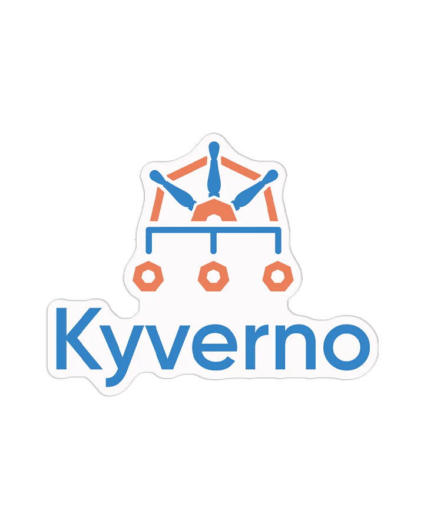
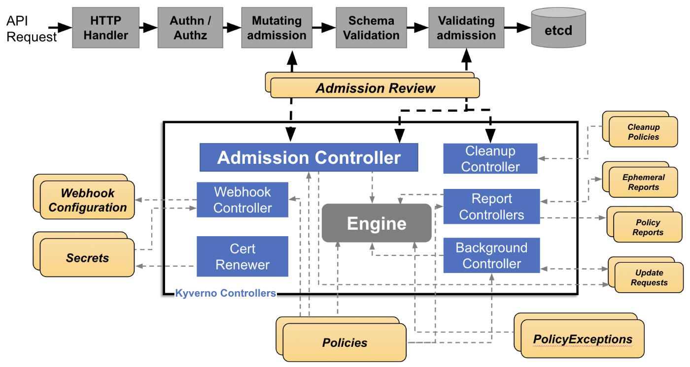

# Kyverno
 

Kyverno is a **cloud native policy engine**.

Originally built for Kubernetes now it can be used outside of it as a unified policy language.

Features:
- policies as declarative YAML files
- enforces policies as a Kubernetes admission controller
- validate, mutate, generate, or cleanup any Kubernetes resource
- verify container images and metadata
- policies for any JSON payload
- policy reporting using the CNCF Policy WG
- flexible policy exception management
- tooling for unit and e2e testing of policies

## Table of Contents
1. [How Kyverno works](#how-kyverno-works)
    1. [Kubernetes Admission Controls](#Kubernetes-Admission-Controls)
        1. [Architecture](#architecture)
        1. [High availability](#high-availability)
2. [Quick start](#quick-start)
    1. [Validate Resources](#validate-resources)
    1. [Mutate Resources](#mutate-resources)
    1. [Generate Resources](#generate-resources)
1. [Admission Controllers 101](#admission-controllers-101)
    1. [Dynamic Admission controllers](#dynamic-admission-controllers)
    1. [Webhooks](#webhooks)
    1. [Controllers](#controllers)
    1. [More details](#more-details)
        1. [Order](#order)
        1. [Limitations](#limitations)
        1. [Precautions](#precautions)
        1. [Availability](#availability)
        1. [Security](#security)
1. [Installation](#installation)
1. [Configuring Kyverno](#configuring-kyverno)
    1. [Certificate Management](#certificate-management)
        1. [Default certificates](#default-certificates)
        1. [Certificates rotation](#certificates-rotation)
        1. [Custom certificates](#custom-certificates)
    1. [Role Based Access Controls](#role-based-access-controls)
    1. [ConfigMap Keys](#configmap-keys)
    1. [Container Flags](#container-flags)
    

## How Kyverno works

### Kubernetes Admission Controls
Kyverno runs as a **dynamic admission controller**.
It receives validating and mutating admission webhook HTTP callbacks from the Kubernetes API server and:
- apply matching policies to return results that enforce admission policies
- or reject requests

Policy enforcement is captured using **Kubernetes events**.

#### Architecture



The Webhook is the server which handles incoming AdmissionReview requests from the Kubernetes API server and sends them to the Engine for processing. 

It is dynamically configured by the **Webhook Controller** which watches the installed policies and modifies the webhooks to request only the resources matched by those policies. 

The **Cert Renewer** is responsible for watching and renewing the certificates, stored as Kubernetes Secrets, needed by the webhook. 

The **Background Controller** handles all generate and mutate-existing policies by reconciling UpdateRequests, an intermediary resource. 

The **Report Controllers** handle creation and reconciliation of Policy Reports from their intermediary resources, Admission Reports and Background Scan Reports.

#### High availability
A highly-available installation of Kyverno is one in which the controllers selected for installation are configured to run with **multiple replicas**. Depending on the controller, the additional replicas may also serve the purpose of increasing the scalability of Kyverno. Docs for how availability is handled in each component [here](https://kyverno.io/docs/high-availability/).

---
## Quick start

Install Kyverno:
```bash
kubectl create -f https://github.com/kyverno/kyverno/releases/download/v1.13.0/install.yaml
```

It is comprised of:

Deployments (admission is the only one required):
```bash
NAME                            READY   UP-TO-DATE   AVAILABLE   AGE
kyverno-admission-controller    1/1     1            1           28m
kyverno-background-controller   1/1     1            1           28m
kyverno-cleanup-controller      1/1     1            1           28m
kyverno-reports-controller      1/1     1            1           28m
```

Services:
```bash
NAME                                    TYPE        CLUSTER-IP       EXTERNAL-IP   PORT(S)    AGE
kyverno-background-controller-metrics   ClusterIP   10.107.133.177   <none>        8000/TCP   27m
kyverno-cleanup-controller              ClusterIP   10.98.138.186    <none>        443/TCP    27m
kyverno-cleanup-controller-metrics      ClusterIP   10.109.162.27    <none>        8000/TCP   27m
kyverno-reports-controller-metrics      ClusterIP   10.103.245.7     <none>        8000/TCP   27m
kyverno-svc                             ClusterIP   10.109.220.135   <none>        443/TCP    27m
kyverno-svc-metrics                     ClusterIP   10.106.219.171   <none>        8000/TCP   27m
```

### Validate Resources

Validation is a "yes" or "no" decision making progress.

After validation **Policy Reports** can be produced. <br> 
Policry Reports are custom kubernetes resources created and managed by Kyverno, [docs](https://kyverno.io/docs/policy-reports/). <br> 
If resources violate multiple rules, there will be multiple entries. When resources are deleted, their entry will be removed from the report. Reports, therefore, __always represent the current state of the cluster__ and do not record historical information.

Example policy: label *team* on every pod.
```yaml
apiVersion: kyverno.io/v1
kind: ClusterPolicy
metadata:
  name: require-labels
spec:
  rules:
  - name: check-team
    match:
      any:
      - resources:
          kinds:
          - Pod
    validate:
      failureAction: Enforce
      message: "label 'team' is required"
      pattern:
        metadata:
          labels:
            team: "?*"
```

- `failureAction`
    - `Enforce`: it blocks Pods that are non-compliant.
    - `Audit`: it will report violations but not block requests.

Create a depliyment without the label:
```bash
kubectl create deployment nginx --image=nginx
```
Error message:
```bash
Error: failed to create deployment: admission webhook "validate.kyverno.svc-fail" denied the request: 

resource Deployment/default/nginx was blocked due to the following policies 

require-labels:
  autogen-check-team: 'validation error: label ''team'' is required. rule autogen-check-team
    failed at path /spec/template/metadata/labels/team/'
```

Create now a pod with the label *team*:
```bash
kubectl run nginx --image nginx --labels team=backend
```

Get PolicyReport:
```bash
kubectl get policyreport -o wide
NAME                                   KIND   NAME    PASS   FAIL   WARN   ERROR   SKIP   AGE
ec55b7ef-4c80-426e-8538-96af2a6080a8   Pod    nginx   1      0      0      0       0      61s
```

Policy reports are both tool- and user-friendly, separated from the policy that generated them. <u>This separation is useful for users who don't need or have access to Kyverno policies</u>.

Delete the policy:
```bash
kubectl delete clusterpolicy require-labels
```

More info on validating rules [here](https://kyverno.io/docs/writing-policies/validate/).

### Mutate Resources

Mutation is the act of change a resource so that can be admitted into the cluster. <br>
A mutate rule selects some type of resource (like Pods or ConfigMaps) and defines what the desired state should look like.

Example of mutation rule:

```yaml
apiVersion: kyverno.io/v1
kind: ClusterPolicy
metadata:
  name: add-labels
spec:
  rules:
  - name: add-team
    match:
      any:
      - resources:
          kinds:
          - Pod
    mutate:
      patchStrategicMerge:
        metadata:
          labels:
            +(team): bravo
```

More info on mutating rules [here](https://kyverno.io/docs/writing-policies/mutate/).

### Generate Resources
Kyverno has the ability to generate a new Kubernetes resource based upon a definition stored in a policy. <br>
In addition to the initial generation, it has the ability to **continually synchronize** the resources it has generated.

1. We will use a Kyverno generate policy to generate an image pull secret in a new Namespace.
1. First, create this Kubernetes Secret in your cluster which will simulate a real image pull secret:
    ```bash
    kubectl -n default create secret docker-registry regcred \
        --docker-server=myinternalreg.corp.com \
        --docker-username=john.doe \
        --docker-password=Passw0rd123! \
        --docker-email=john.doe@corp.com

    secret/regcred created
    ```
1. By default, Kyverno is configured with **minimal permissions** and does not have access to security sensitive resources like Secrets. Let's provide additional permissions using cluster role aggregation. The following role permits the Kyverno background-controller to create (clone) secrets:
    ```bash
    kubectl apply -f- << EOF
        apiVersion: rbac.authorization.k8s.io/v1
        kind: ClusterRole
        metadata:
        name: kyverno:secrets:view
        labels:
            rbac.kyverno.io/aggregate-to-admission-controller: "true"
            rbac.kyverno.io/aggregate-to-reports-controller: "true"
            rbac.kyverno.io/aggregate-to-background-controller: "true"
        rules:
        - apiGroups:
        - ''
        resources:
        - secrets
        verbs:
        - get
        - list
        - watch
        ---
        apiVersion: rbac.authorization.k8s.io/v1
        kind: ClusterRole
        metadata:
        name: kyverno:secrets:manage
        labels:
            rbac.kyverno.io/aggregate-to-background-controller: "true"
        rules:
        - apiGroups:
        - ''
        resources:
        - secrets
        verbs:
        - create
        - update
        - delete
    EOF

    clusterrole.rbac.authorization.k8s.io/kyverno:secrets:view created
    clusterrole.rbac.authorization.k8s.io/kyverno:secrets:manage created
    ```
1. The "sync-secrets" policy will match on any newly-created Namespace and will clone the Secret we just created earlier into that new Namespace.
    ```yaml
    apiVersion: kyverno.io/v1
    kind: ClusterPolicy
    metadata:
    name: sync-secrets
    spec:
    rules:
    - name: sync-image-pull-secret
        match:
        any:
        - resources:
            kinds:
            - Namespace
        generate:
        apiVersion: v1
        kind: Secret
        name: regcred
        namespace: "{{request.object.metadata.name}}"
        synchronize: true
        clone:
            namespace: default
            name: regcred
    ```

More info on generating rules [here](https://kyverno.io/docs/writing-policies/generate/).

---
## Admission Controllers 101
#### An introduction to admission controllers in Kubernetes
All admission controllers function **after** authenticating and authorizing requests **but before** persisting (saving) them to the backend.

There are two types of admission controller: built-in and dynamic.

### Dynamic Admission controllers
Dynamic admission controllers are those which are implemented as part of the **MutatingAdmissionWebhook** and **ValidatingAdmissionWebhook** admission controllers and contain two parts, a webhook and a controller.

- **Webhook**: A Kubernetes resource which contains a set of directives intended for the API server:
    1. What resources to send
    1. Where they should be sent
    1. What the response behavior should be 
- **Controller**: one or more Pods, which listens and responds to requests sent to it by the Kubernetes API server. The requests it receives are a result of the instructions defined in the webhook.

### Webhooks
Webhooks define a sort of “bridge” between the API server and a separate piece of software (controllers).

Types of webhooks:
- ValidatingWebhookConfiguration
- MutatingWebhookConfiguration

Multiple of each type can be created in the same cluster.
Example of Validating one:
```yaml
apiVersion: admissionregistration.k8s.io/v1
kind: ValidatingWebhookConfiguration
metadata:
  name: kyverno-resource-validating-webhook-cfg
webhooks:
  - name: validate.kyverno.svc-fail  ## The name of this webhook
    rules:                           ## What resources should be sent
      - apiGroups:
          - apps
        apiVersions:
          - v1
        operations:
          - CREATE
        resources:
          - deployments
    clientConfig:                    ## Where the resources should be sent
      caBundle: LS0t<snip>0tLS0K
      service:
        name: kyverno-svc
        namespace: kyverno
        path: /validate/fail
        port: 443
    timeoutSeconds: 10               ## How long should the API server wait
    failurePolicy: Fail              ## What should happen after the wait is over
```

### Controllers
The controller is the part that listens for the requests sent by the API server and is prepared to respond, and can be deployed as one or more pods.

This controller, like the API server with the webhook, must have some instruction for how to respond to requests. This instruction is provided to it in the form of a policy.

A **policy** is a custom Kubernetes resource. Once the controller examines the policy it is prepared to make a decision for resources it receives.

ontrollers receiving requests from the Kubernetes API server do so over **HTTP/REST**.

The contents of that request are a “packaging” or “wrapping” of the resource, which has been defined via the webhook, in addition to other pertinent information about who or what made the request. This package is called an **AdmissionReview** (more info [here](https://kyverno.io/docs/writing-policies/jmespath/#admissionreview)).

A webhook is an instruction for the Kubernetes API server while a policy is an instruction for the controller.

### More details

When a dynamic admission controller such as Kyverno receives a request from the API server, irrespective of whether that request is for a mutation or validation, the request already contains all modifications made to it by the API server and its various internal controllers including built-in admission controllers.

#### Order
During the dynamic **mutating** admission phase, the webhooks are called by their names in **lexical order**. The ordering cannot be influenced aside from changing the name of the MutatingWebhookConfiguration resource itself.

During the dynamic **validating** admission phase, webhooks are called in parallel order: they are called **simultaneously** and all downstream controllers receive responses roughly at the same time.

#### Limitations
The first limitation is the **operations** which may be controlled. The second are the **types of resources** which may be controlled.

There are four operations which the API server recognizes:
- **CREATE**: when a resource is created.
- **UPDATE**: when an existing resource is modified, regardless of whether it results from a verb “patch” or “update”. Because an update means a resource has already been created, the oldObject structure in the AdmissionReview resource will be populated.
- **DELETE**: when a resource is deleted. Note that this may not always align to a kubectl delete command. Depending on the resource being deleted, there may first be an UPDATE followed by the ultimate DELETE operation.
- **CONNECT**: when a user/process performs a kubectl exec command against a Pod.

Notice how “get”, “list”, or “watch” are absent. The Kubernetes API server will not permit sending of any such read-related requests to admission controllers. <u>Adding an operation such as GET to the webhook will be ignored</u>.

The Kubernetes API server allows basically all API resources to be sent to dynamic admission controllers with the exception of two: *MutatingWebhookConfigurations* and *ValidatingWebhookConfigurations*.

#### Precautions
The failurePolicy field in a webhook tells the API server what to do if the controller doesn’t respond in time, but the admissions process always waits for a reply.

Since dynamic admission controllers intercept most API operations, they must handle very high request volumes, especially if webhooks are configured broadly (e.g., with '*' for resources and operations).
Poor configuration can overload controllers and seriously impact cluster performance, so webhook settings must be handled carefully:
- Only request the <u>resources you actually need</u>. Configuring a webhook for '*' should be a last resort.
- Limit the types of <u>operations which matter</u>. Including UPDATE in those operations can result in an order of magnitude greater of admission requests to process.
- When configuring webhooks, <u>consider cluster management activities</u> like scaling or chaos engineering, as they can cause sudden spikes in admission requests.

On the Controllers side:
- **Scaling**: Kyverno supports both horizontal and vertical scaling. Docs [here](https://kyverno.io/docs/installation/scaling/).
- **External latency**: When policies call external services (like image registries or config systems), they introduce extra latency and can create bottlenecks. To avoid performance issues, keep external calls fast, reliable, and minimize their use whenever possible.

#### Availability
Availability of the controller can be disrupted in a number of ways: cluster failures, improper node scaling procedures, user error, etc. Having **multiple replicas** can mitigate some of these scenarios but not all. Docs [here](https://kyverno.io/docs/high-availability/).

Webhooks can use namespace and object selectors to filter requests, which is important to avoid blocking critical components, including the controller's own namespace. <u>Excluding the controller’s namespace helps ensure recovery from failures</u>. Docs [here](https://kyverno.io/docs/installation/#security-vs-operability).

#### Security
> ⚠️ When using objectSelector, it may be possible for users to spoof the same label key/value used to configure the webhooks should they discover how it is configured, thereby allowing resources to circumvent policy detection. For this reason, a namespaceSelector using the kubernetes.io/metadata.name immutable label is recommended.

The choices and their implications are therefore:

1. Do not exclude system Namespaces, including Kyverno’s, (not default) during installation resulting in a more secure-by-default posture but potentially requiring manual recovery steps in some outage scenarios.
2. Exclude system Namespaces during installation (default) resulting in easier cluster recovery but potentially requiring other methods to secure those Namespaces, for example with Kubernetes RBAC.

## Installation

Standalone:
```bash
helm repo add kyverno https://kyverno.github.io/kyverno/
helm repo update
helm install kyverno kyverno/kyverno -n kyverno --create-namespace
```
High availability (for production):
```bash
helm install kyverno kyverno/kyverno -n kyverno --create-namespace \
    --set admissionController.replicas=3 \
    --set backgroundController.replicas=2 \
    --set cleanupController.replicas=2 \
    --set reportsController.replicas=2
```
To install pre-release versions, such as alpha, beta, and rc (release candidates) versions, add the `--devel` switch to Helm:
```bash
helm install kyverno kyverno/kyverno -n kyverno --create-namespace --devel
```
Install Pod Security Standard Policies:
```bash
helm install kyverno-policies kyverno/kyverno-policies -n kyverno
```
Install using yaml:
```bash
kubectl create -f https://github.com/kyverno/kyverno/releases/download/v1.11.1/install.yaml
```
Testing unreleased code:
```bash
kubectl create -f https://github.com/kyverno/kyverno/raw/main/config/install-latest-testing.yaml
```

## Configuring Kyverno

### Certificate Management
Kyverno requires a **CA-signed certificate and key** to setup secure TLS communication with the Kubernetes API server.

#### Default certificates
<u>By default</u> Kyverno auto-generates self-signed Certificate Authority (CA) which expires in one year, and then it will gracefully handle regeneration upon expiry.

#### Certificates rotation
At a minimum, managed certificates are checked for validity every 12 hours. The renewal process:
- Remove expired certificates from the secret.
- Check if any certificates will expire in less than 15 days.
- Generate a new certificate if needed.
- Add new certificates to the secret, along with valid ones.
- Reconfigure webhooks with the updated certificate bundle.
- Update the Kyverno server to use the new certificate.
Certificates are renewed approximately 15 days before expiry.

#### Custom certificates
You can install your own CA-signed certificate or generate a self-signed CA to sign certificates for controllers. Once you have the certificates, store them as Kubernetes Secrets. Kyverno uses these Secrets if available, otherwise, it defaults to its certificate management method. You are responsible for certificate regeneration/rotation. Only RSA certificates are supported.

##### How to create custom certificates using Step CLI
```bash
# Create a self-signed CA
step certificate create kyverno-ca rootCA.crt rootCA.key --profile root-ca --insecure --no-password --kty=RSA
# Generate leaf certificates with 5 year expiry
step certificate create kyverno-svc tls.crt tls.key --profile leaf \
    --ca rootCA.crt --ca-key rootCA.key \
    --san kyverno-svc --san kyverno-svc.kyverno --san kyverno-svc.kyverno.svc --not-after 43200h \
    --insecure --no-password --kty=RSA

step certificate create kyverno-cleanup-controller cleanup-tls.crt cleanup-tls.key --profile leaf \
    --ca rootCA.crt --ca-key rootCA.key \
    --san kyverno-cleanup-controller --san kyverno-cleanup-controller.kyverno --san kyverno-cleanup-controller.kyverno.svc --not-after 43200h \
    --insecure --no-password --kty=RSA
# Verify the content of the certificate
step certificate inspect tls.crt --short
# Now you can create the secrets necessary to Kyverno (do not change the names)
kubectl create ns <namespace>

kubectl create secret tls kyverno-svc.kyverno.svc.kyverno-tls-pair --cert=tls.crt --key=tls.key -n <namespace>
kubectl create secret generic kyverno-svc.kyverno.svc.kyverno-tls-ca --from-file=rootCA.crt -n <namespace>

kubectl create secret tls kyverno-cleanup-controller.kyverno.svc.kyverno-tls-pair --cert=cleanup-tls.crt --key=cleanup-tls.key -n <namespace>
kubectl create secret generic kyverno-cleanup-controller.kyverno.svc.kyverno-tls-ca --from-file=rootCA.crt -n <namespace>
```

### Role Based Access Controls
Kyverno creates several Roles, ClusterRoles, RoleBindings, and ClusterRoleBindings some of which may need to be customized depending on additional functionality required.

Kyverno’s default permissions are designed to cover commonly used and security non-critical resources. Hence, Kyverno will need to be configured with additional permissions for CRDs, or to allow access to security critical resources.

To avoid upgrade issues, it is highly recommended that default roles are not modified but new roles are used to extend them.

**Required permissions** for Kyverno features:

| Controller | Permission Verbs | Required For |
| --- | --- | --- | 
| admission-controller | view, list, … | API Calls |
| admission-controller | view, list, watch | Global Context |
| background-controller | update, view, list, watch | Mutate Policies |
| background-controller | create, update, delete, view, list, watch | Generate Policies |
| reports-controller | view, list, watch | Policy Reports |
| cleanup-controller | delete, view, list, watch | Cleanup Policies |

To extend a controller’s permissions, add a new role with one or more of the following **labels**:


| Controller | Role Aggregation Label |
| --- | --- |
| admission-controller | rbac.kyverno.io/aggregate-to-admission-controller: “true”
| background-controller | rbac.kyverno.io/aggregate-to-background-controller: “true”
| reports-controller | rbac.kyverno.io/aggregate-to-reports-controller: “true”
| cleanup-controller | rbac.kyverno.io/aggregate-to-cleanup-controller: “true”

Example:
```yaml
apiVersion: rbac.authorization.k8s.io/v1
kind: ClusterRole
metadata:
  name: kyverno:create-deployments
  labels:
    rbac.kyverno.io/aggregate-to-background-controller: "true"  
rules:
- apiGroups:
  - apps
  resources:
  - deployments
  verbs:
  - create
  - update
```

### ConfigMap Keys
The following keys are used to **control the behavior of Kyverno** and <u>must be set in the Kyverno ConfigMap</u>. Kyverno watches for changes to this ConfigMap and will load any updates which occur.

- **defaultRegistry**: default image registry if not specified (default: docker.io).
- **enableDefaultRegistryMutation**: allow updating internal context with defaultRegistry (default: true).
- **excludeGroups**: groups excluded from processing (default: `system:serviceaccounts:kube-system`,`system:nodes`).
- **excludeUsernames**: usernames excluded from processing (default: `!system:kube-scheduler`).
- **excludeRoles**: roles excluded from processing (default: undefined).
- **excludeClusterRoles**: cluster roles excluded from processing (default: undefined).
- **generateSuccessEvents**: generate success events (default: `false`).
- **matchConditions**: use CEL expressions to filter admission requests (requires Kubernetes `1.27+`).
- **resourceFilters**: skip policy evaluation for specific resources (not for background scan).
- **updateRequestThreshold**: max updaterequests for mutateExisting and generate policies (default: `1000`).
- **webhooks**: configure namespace/object exclusions in webhooks (default excludes kube-system, kyverno).
- **webhookAnnotations**: add annotations to webhooks (default: undefined; for AKS support).
- **webhookLabels**: add labels to webhooks (default: undefined).


### Container Flags