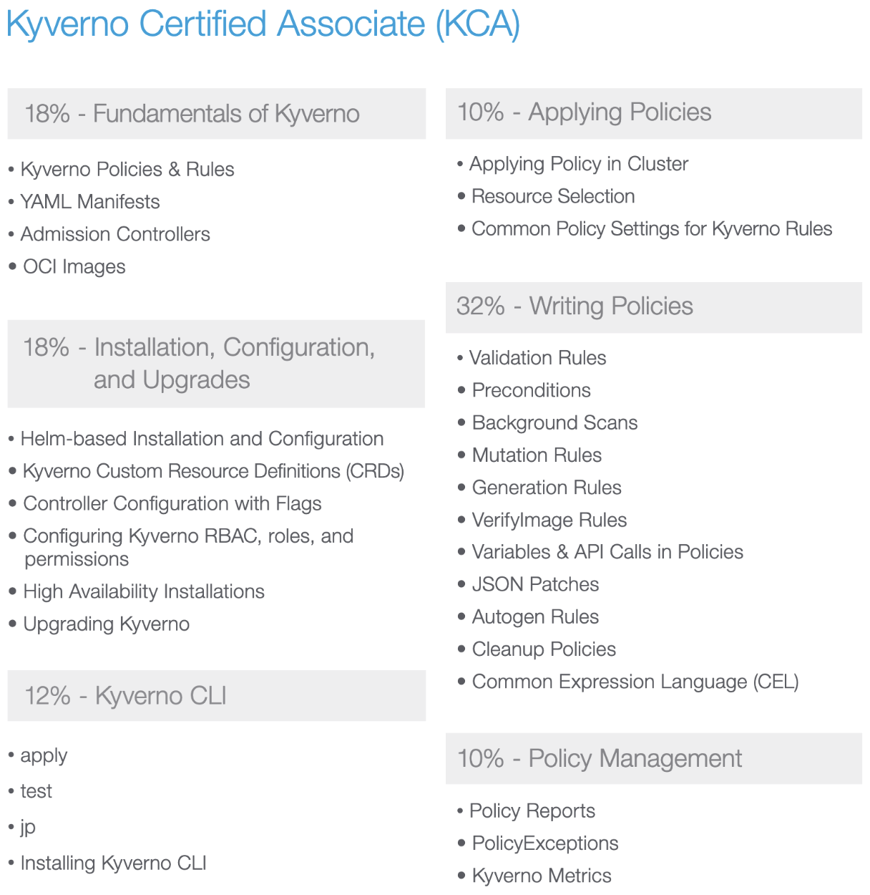

Certification requirements:

Curriculum [here](https://github.com/cncf/curriculum/blob/master/CKA_Curriculum_v1.32.pdf).

|Domain	| Weight |
|---|---|
|Fundamentals of Kyverno | 18% |
|Installation, Configuration, and Upgrades | 18% |
|Kyverno CLI | 12% |
|Applying Policies | 10% |
|Writing Policies | 32% |
|Policy Management | 10% |

Legend:
✅
⭕

---
**32% - Writing Policies**
- Validation Rules
- Preconditions
- Background Scans
- Mutation Rules
- Generation Rules
- VerifyImage Rules
- Variables & API Calls in Policies
- JSON Patches
- Autogen Rules
- Cleanup Policies
- Common Expression Language (CEL)

**18% - Fundamentals of Kyverno**
- Kyverno Policies & Rules
- YAML Manifests
- Admission Controllers
- OCI Images

**18% - Installation, Configuration, and Upgrades**
- Helm-based Installation and Configuration
- Kyverno Custom Resource Definitions (CRDs)
- Controller Configuration with Flags
- Configuring Kyverno RBAC, roles, and permissions
- High Availability Installations
- Upgrading Kyverno

**12% - Kyverno CLI**
- apply
- test
- jp
- Installing Kyverno CLI

**10% - Applying Policies**
- Applying Policy in Cluster
- Resource Selection
- Common Policy Settings for Kyverno rules

**10% - Policy Management**
- Policy Reports
- PolicyExceptions
- Kyverno metrics

---

